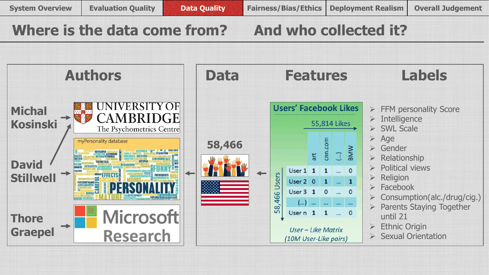
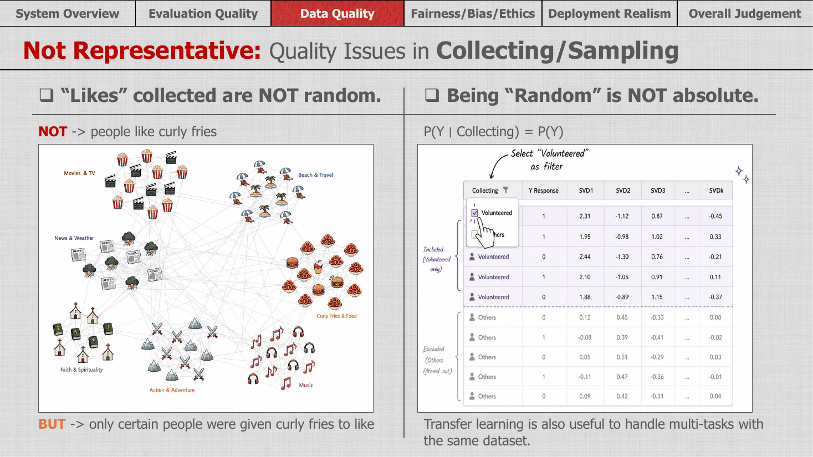
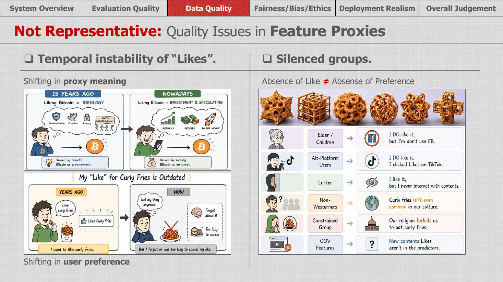
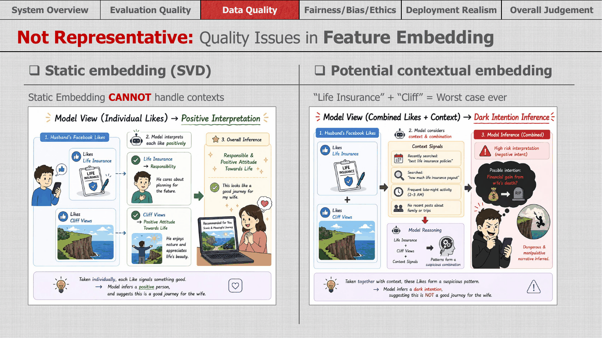
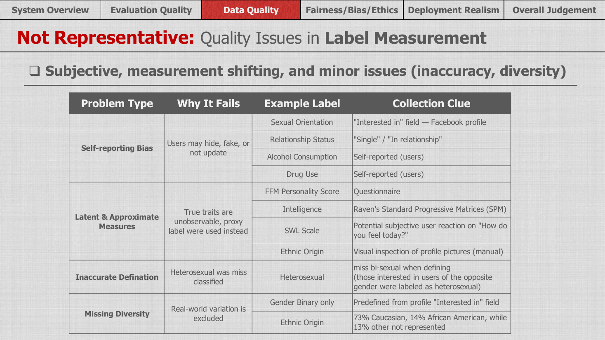
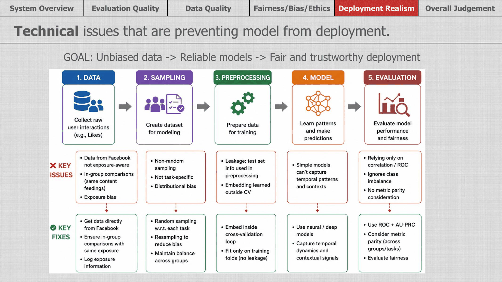
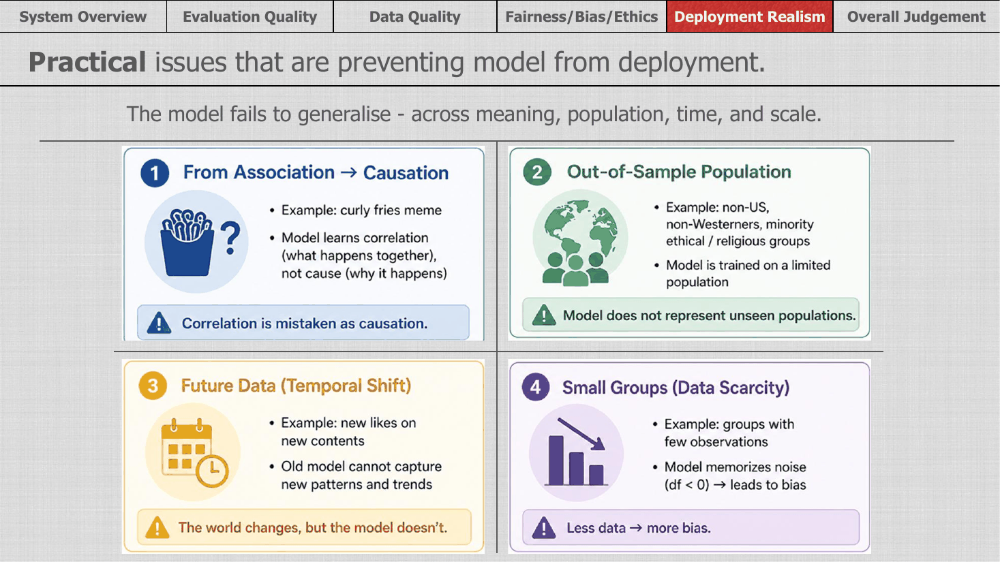
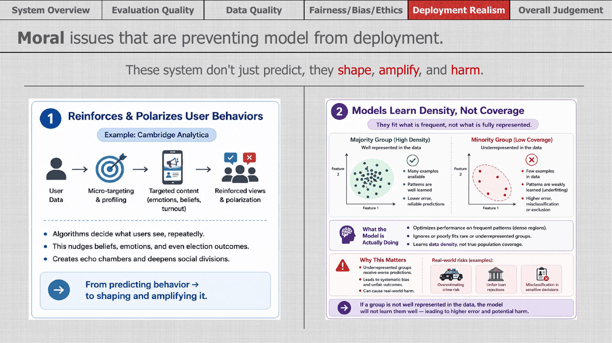
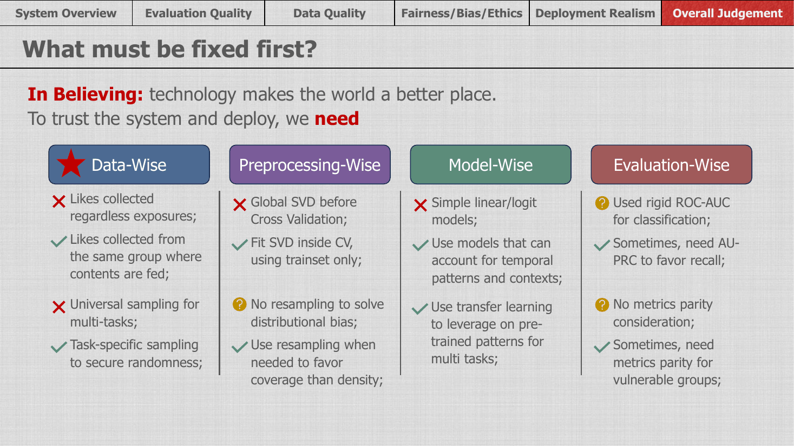

# A Data Quality Framework for Critically Evaluating Machine Learning Studies

**Can we trust a model that predicts personality, politics or sexual orientation from Facebook Likes?**

This repository presents a framework for judging whether a machine learning system is ready to be trusted and deployed, starting from the question most evaluations skip: *is the data itself good enough?* I apply it to a well-known study, Kosinski, Stillwell and Graepel (2013), *Private traits and attributes are predictable from digital records of human behavior* (PNAS), which predicted personal traits from 58,466 US users' Facebook Likes.

The central idea: **a model is only as trustworthy as its data.** High accuracy on a test set says little if the data was collected, represented or labelled in ways that don't reflect the people the model will be used on.

> This is my section of a team critical evaluation (4 students) for DATA425 *Foundations of Deep Learning*, University of Canterbury. The project received an A+ and was selected as the lecturer's favourite. I wrote the **Data Quality**, **Deployment Realism** and **Overall Judgement** sections shown here; the other sections were written by teammates and are not included.

## The framework at a glance

Data quality is checked in four layers, following the data from collection to label. Each layer asks whether the data is **representative** of the people and meanings the model claims to capture.

| Layer | Key question | What I found in the Facebook Likes study |
|---|---|---|
| **1. Sampling** | Who is in the data, and how did they get there? | Users *volunteered* through a personality app, so "random" only meant random *within* volunteers. And Likes aren't random: people can only Like what they were shown. |
| **2. Feature proxies** | Does the feature still mean what we think it means? | A Like's meaning shifts over time (liking Bitcoin: ideology then, investment now), and old Likes are rarely removed. Many groups are silent: no Like ≠ no preference. |
| **3. Feature embedding** | Does the representation keep the context? | Static SVD embeddings read each Like on its own and lose context: individually harmless Likes can form a very different pattern together. |
| **4. Labels** | Are the "true" answers actually true? | Self-reported, latent and approximate labels, an inaccurate definition (bisexual users labelled heterosexual), and missing diversity (binary gender only; ethnicity 73% Caucasian, 14% African American). |

Then the same thinking is carried into **deployment**, at three levels: technical, practical and moral.

## 1. Where does the data come from?



The study linked 58,466 US volunteers' Likes (a user–Like matrix of about 10 million pairs across 55,814 Likes) with labels such as personality scores, intelligence, age, gender, political and religious views, substance use and sexual orientation. Knowing **who collected the data, from whom, and how** is the starting point for every later question.

## 2. Sampling: "random" is not absolute



- **Likes are not random.** The famous finding that liking curly fries predicts intelligence isn't about curly fries. It reflects *who was shown* the curly fries page: Likes depend on exposure, and exposure depends on friends and platform feeds.
- **Being random is relative.** Randomly splitting volunteers into train and test sets only makes the model representative of *volunteers*, P(Y | volunteered), not of the wider population.

## 3. Feature proxies: a Like is an unstable signal



- **Proxy meaning shifts.** The same Like can mean different things at different times.
- **User preference shifts.** People rarely remove old Likes, so the data records who they *were*, not who they are.
- **Silenced groups.** Children and older people who don't use Facebook, people active on other platforms, lurkers who never click Like, non-Western users, groups whose culture or religion rules certain things out, and new content that didn't exist when the model was trained: in every case, the *absence* of a Like carries no reliable meaning.

## 4. Feature embedding: context matters



The study compressed Likes with **SVD**, a static embedding that treats each Like independently. Taken one by one, *"likes life insurance"* and *"likes cliff views"* both look positive. Taken together, and with context, the same Likes can suggest something very different. A contextual representation would capture combinations and context that SVD cannot.

## 5. Labels: measuring the unmeasurable



| Problem | Why it fails | Examples |
|---|---|---|
| **Self-reporting bias** | Users may hide, fake or not update answers | Sexual orientation, relationship status, alcohol and drug use |
| **Latent and approximate measures** | True traits can't be observed, so proxies are used | Personality questionnaire, intelligence test, life satisfaction, ethnicity judged from profile pictures |
| **Inaccurate definitions** | Categories don't match reality | Users interested in the opposite gender labelled heterosexual, which misses bisexual users |
| **Missing diversity** | Real-world variation is excluded | Binary gender only; ethnicity 73% Caucasian and 14% African American, with the remaining 13% not represented |

## 6. Deployment realism: from data to decisions

The data-quality problems don't stay in the data. They follow the model into the real world.

**Technical:** each stage of the pipeline has issues and a fix.



For example, data leakage: the SVD embedding was fitted on the whole dataset *before* cross-validation, so information from the test folds leaked into training. The fix is to fit the embedding inside each cross-validation fold, on training data only.

**Practical:** the model fails to generalise across meaning, population, time and scale.



**Moral:** these systems don't just predict; they shape, amplify and harm.



Profiling can drive micro-targeting that reinforces and polarises behaviour (as in the Cambridge Analytica case), and because models learn **density, not coverage**, under-represented groups get worse predictions, with real consequences in areas such as policing, lending and other sensitive decisions.

## 7. Overall judgement: what must be fixed first?



**Data comes first.** No modelling technique can recover information the data never captured.

| Area | Problem | Fix |
|---|---|---|
| **Data** (highest priority) | Likes collected regardless of exposure; one sample reused for many tasks | Collect Likes within groups shown the same content; sample specifically for each task |
| **Preprocessing** | Global SVD before cross-validation; no resampling for distributional bias | Fit SVD inside CV on training data only; resample to favour coverage over density |
| **Model** | Simple linear and logistic models | Models that capture temporal patterns and context; transfer learning across related tasks |
| **Evaluation** | ROC-AUC alone; no metric parity | Add AU-PRC where recall matters; check metric parity for vulnerable groups |

## A checklist you can reuse

The same questions apply to any machine learning project, not only this study:

**Sampling**
- [ ] Who could possibly end up in this dataset, and who couldn't?
- [ ] Is the data "random" only within a self-selected or filtered group?
- [ ] Did every observation have the same chance of exposure to what was measured?

**Features**
- [ ] Does each feature mean the same thing across time, cultures and groups?
- [ ] Does a missing value or absent action carry real meaning, or just no information?
- [ ] Does the representation (e.g. an embedding) keep the context and combinations that matter?

**Labels**
- [ ] Are labels self-reported, estimated from a proxy, or defined in a way that excludes people?
- [ ] Is the real diversity of the population represented in the label categories?

**Pipeline and deployment**
- [ ] Is every preprocessing step (scaling, embedding, feature selection) fitted inside cross-validation, on training data only?
- [ ] Do the metrics suit the task (e.g. AU-PRC for rare outcomes) and hold up for each group?
- [ ] Will the model's predictions change the behaviour they are predicting?

## Files

```
README.md                                  this overview and the reusable checklist
data-quality-and-deployment-slides.pdf     my slides (Data Quality, Deployment Realism, Overall Judgement)
figures/                                   the slides as images
```

## References

- Kosinski, M., Stillwell, D., & Graepel, T. (2013). Private traits and attributes are predictable from digital records of human behavior. *Proceedings of the National Academy of Sciences, 110*(15), 5802–5805. https://doi.org/10.1073/pnas.1218772110
- Symons, J., & Alvarado, R. (2019). *Facebook algorithms and personal data.* Philosophy Documentation Center.
- Bakir, V. (2020). Psychological operations in digital political campaigns: Assessing Cambridge Analytica's psychographic profiling and targeting. *Frontiers in Communication, 5*, Article 67. https://doi.org/10.3389/fcomm.2020.00067
- Delić, A. (2022, December 22). *Ex-FIFA executive Jack Warner financed "election engineering" campaign in Trinidad.* OCCRP.
- Auxier, B., Rainie, L., Anderson, M., Perrin, A., Kumar, M., & Turner, E. (2019). *Facebook algorithms and personal data.* Pew Research Center.
- Fybish, G., & Susnjak, T. (2026). *When predictions shape reality: A socio-technical synthesis of performative predictions in machine learning.* arXiv:2601.04447. https://arxiv.org/abs/2601.04447
